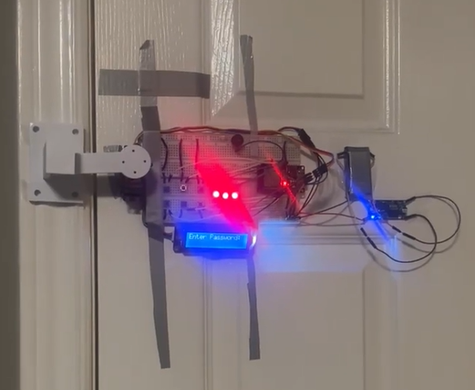

# Unlockable — Smart Door Lock

**Secure access control with PIN authentication.**

A PIN-based smart door lock built on an ESP32. A user enters a 4-digit code on a pushbutton keypad; if it matches, a servo drives the latch open. The system tracks failed attempts, locks itself out temporarily after three of them, and lets an authenticated user change the PIN without re-flashing the board.

The control logic is written as a **Mealy finite state machine** — outputs (LCD text, buzzer tone, servo position, LED state) depend on both the current state and the button event that caused the transition.



---

## Demos

| | |
|---|---|
| **Hardware demo** | [Unlockable Design Project](https://youtube.com/shorts/GK7am2XnWW0) — the lock running on a real door |
| **App demo** | [Unlockable app demo](https://www.youtube.com/watch?v=GrHbliP2Q14) — companion app walkthrough (also in this repo at [`media/app-demo.mp4`](media/app-demo.mp4)) |

---

## Features

- **4-digit PIN entry** with masked (`*`) feedback on the LCD
- **Servo-driven lock** — 0° locked, 90° unlocked
- **Attempt tracking** — three status LEDs extinguish one by one as attempts are used
- **Timed lockout** — 30 seconds with a live countdown after 3 consecutive failures
- **Password change** — confirm the old PIN, then enter a new one, all from the keypad
- **Audio feedback** — 3 kHz tone on unlock, 2 kHz tone on a wrong entry
- **Software debouncing** — 250 ms guard between accepted presses
- **Battery powered** — 9 V source stepped down through a buck converter

---

## Bill of materials

| Qty | Component | Notes |
|---|---|---|
| 1 | ESP32 microcontroller | Dual-core, drives all I/O |
| 1 | Servo motor (MG996R) | Latch actuator, 50 Hz / 500–2400 µs |
| 1 | 16×2 LCD display | DFRobot RGB LCD1602, I²C address `0x6B` |
| 6 | Momentary pushbuttons | Digit entry (values 1–6) plus lock / change-PIN |
| 3 | Red LEDs | Remaining-attempt indicators |
| 3 | 300 Ω resistors | LED current limiting |
| 1 | Piezo buzzer | Success and error tones |
| 1 | Buck converter | Steps the 9 V supply down for the logic rail |
| 1 | 9 V battery | Power source |

### Pinout

| Signal | GPIO |
|---|---|
| Servo | 26 |
| PB1 – PB6 | 18, 19, 23, 25, 33, 32 |
| LED1 / LED2 / LED3 | 4, 5, 16 |
| Buzzer | 17 |
| I²C SDA / SCL | 21 / 22 |

Buttons are configured as `INPUT_PULLUP`, so each one connects its GPIO to ground when pressed — no external pull-down resistors needed. The LEDs are driven active-low through the 300 Ω resistors.

---

## State machine

Six states, with every transition driven by a button event or a timer. The hand-drawn original is in [`docs/fsm-diagram.pdf`](docs/fsm-diagram.pdf).

| State | Entered when | Behaviour |
|---|---|---|
| **Initial Display** | Power-on | Shows the default PIN for 2 s, then drops to Locked |
| **Locked** | Init done, manual relock, or lockout expiry | Accepts digits; a correct PIN unlocks, 3 wrong PINs trigger the lockout |
| **Timed Lockout** | 3 consecutive wrong PINs | 30-second countdown on the LCD, all input ignored, then back to Locked |
| **Unlocked** | Correct PIN entered | PB1 relocks; PB6 starts a password change |
| **Change Password** | PB6 pressed while unlocked | Verifies the old PIN; correct → Enter New Password, wrong → back to Unlocked |
| **Enter New Password** | Old PIN verified | Stores the new 4-digit PIN, returns to Unlocked |

```
       ┌──────────────┐  correct PIN   ┌──────────────┐   PB6    ┌────────────────┐
       │   LOCKED     │───────────────▶│   UNLOCKED   │─────────▶│ CHANGE PASSWORD│
       │ (entry mode) │◀───────────────│ (PB1 = lock) │◀─────────│ (verify old)   │
       └──────┬───────┘     relock     └──────────────┘  wrong   └───────┬────────┘
              │                               ▲                          │ correct
      wrong   │                               │  new PIN stored          ▼
      PIN ×3  │                        ┌──────┴───────┐          ┌────────────────┐
              ▼                        │              │◀─────────│ ENTER NEW PASS │
       ┌──────────────┐  wait 30s      └──────────────┘          └────────────────┘
       │   LOCKOUT    │────────────────▶ back to LOCKED
       │  30s timer   │
       └──────────────┘
                ▲
                │ start
       ┌────────┴─────────┐
       │ INITIAL DISPLAY  │ ── wait 2s ──▶ LOCKED
       └──────────────────┘
```

Digits are collected into a buffer until four have been entered, at which point the buffer is compared against the stored PIN — either to unlock, or, in change-password mode, to authorize and then overwrite the stored PIN.

The lockout is non-blocking: `millis()` is sampled against the lockout start time each pass through `loop()`, so the countdown updates smoothly instead of stalling the processor in a `delay()`.

---

## Getting started

1. Wire the components according to the pinout and bill of materials above.
2. Install the Arduino IDE and add ESP32 board support via the Boards Manager.
3. Install the required libraries:
   - `DFRobot_RGBLCD1602`
   - `ESP32Servo`
   - `Wire` (bundled with the ESP32 core)
4. Open `project_code.ino`, select your ESP32 board and port, and upload.
5. Open the Serial Monitor at **115200 baud** if you want to watch the boot output.

---

## Usage

On boot the LCD briefly shows the default PIN (`1234`), then switches to the entry screen.

| Action | How |
|---|---|
| Enter a digit | Press PB1–PB6 (values 1–6) |
| Unlock | Enter the correct 4-digit PIN |
| Relock | Press **PB1** while unlocked |
| Change the PIN | Press **PB6** while unlocked, confirm the old PIN, then enter the new one |

**Failed attempts:** each wrong PIN turns off one status LED and sounds the error tone. After the third failure the display switches to `SYSTEM LOCKED` with a countdown, and all input is ignored until the lockout expires. A successful unlock resets the counter and relights the LEDs.

---

## Known limitations

These are deliberate trade-offs for a course-scale prototype, and the obvious next steps if the project is taken further:

- The PIN lives in RAM, so it reverts to `1234` on every power cycle. Persisting it to NVS/EEPROM would fix this.
- The default PIN is displayed on the LCD at startup — convenient for a demo, not something a real lock should do.
- The PIN is compared digit by digit without a constant-time check.
- Button release is handled with blocking `while` loops, which briefly stall the main loop.
- Only digits 1–6 are available, so the keyspace is 6⁴ = 1296 combinations.

---

## Repository contents

| Path | Purpose |
|---|---|
| [`project_code.ino`](project_code.ino) | Complete firmware — FSM, I/O setup, and all state handlers |
| [`docs/fsm-diagram.pdf`](docs/fsm-diagram.pdf) | Hand-drawn Mealy FSM: states, inputs, and outputs |
| [`docs/infographic.pdf`](docs/infographic.pdf) | One-page project poster — overview, components, FSM, demo QR code |
| [`docs/project-brief.pdf`](docs/project-brief.pdf) | Short written description of the system |
| [`media/unlockable-prototype.png`](media/unlockable-prototype.png) | Photo of the assembled lock mounted on a door |
| [`media/app-demo.mp4`](media/app-demo.mp4) | Companion app demo recording |

> The infographic lists the lockout as 60 seconds. The implemented value — and the one in the FSM diagram — is **30 seconds**.

---

## Author

**Sanawar Javaid** — Mechatronics Engineering & Management, McMaster University
[LinkedIn](https://www.linkedin.com/in/sanawar-javaid)
